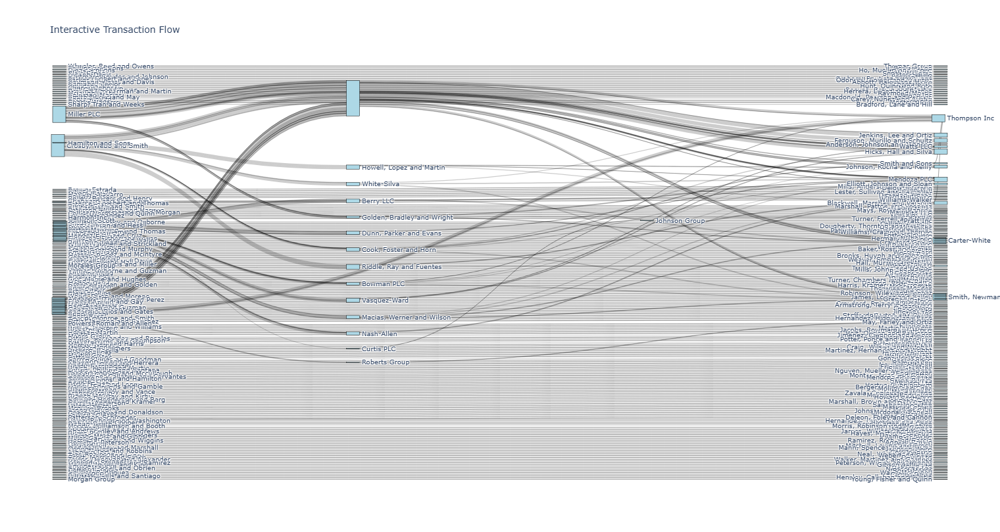

# MuleGraphMiner

Detecting Money Mule Networks in Financial Transaction Graphs Using Graph Neural Networks

## Overview

MuleGraphMiner is a research toolkit designed to identify complex money mule networks characterized by multiple external entities funneling funds through internal bank accounts (mules) and ultimately to common beneficiaries. This project models the mule detection problem as a temporal, heterogeneous, directed multigraph and leverages edge-aware graph neural network architectures combined with real-time subgraph feature extraction.





This repository includes:

- Formal definitions for “external fan-in → internal parking → common beneficiary” mule network motifs with temporal and flow constraints.
- Streaming subgraph feature extraction capturing fan-in counts, pass-through ratios, and beneficiary concentration.
- Edge-aware Graph Transformer models inspired by FraudGT for scoring mule subgraphs.
- Synthetic pattern generator to enable controlled experiments and reproducibility.
- Benchmark experiments, ablation studies, evasion scenarios, and explainability modules.
- Visualization tools for subgraph inspection and alert generation.

## Features

- Scalable motif mining and candidate subgraph builder
- Directed multigraph modeling with edge attribute attention
- Temporal encoding for capturing bursty and sequential patterns
- Explainable alerts with narrative and network visualization
- Synthetic data generator for research and benchmarking

## Getting Started

### Installation

```shell
git clone https://github.com/your-org/MuleGraphMiner.git
cd MuleGraphMiner
pip install -r requirements.txt

```


### Usage

1. Prepare your input transaction data following the prescribed CSV schema.
2. Run the streaming subgraph feature extractor on rolling windows.
3. Train or apply pretrained graph models to score mule-like subgraphs.
4. Generate explainable alert notes and interactive network views for analysts.

Example command line:


## Project Structure


```shell
/data # Sample and synthetic datasets
/scripts # Feature extraction and candidate builder scripts
/models # Graph Transformer architecture and training code
/eval # Evaluation, ablation, and robustness experiments
/utils # Utility and visualization modules
/notebooks # Jupyter notebooks for demos and explainability
```


